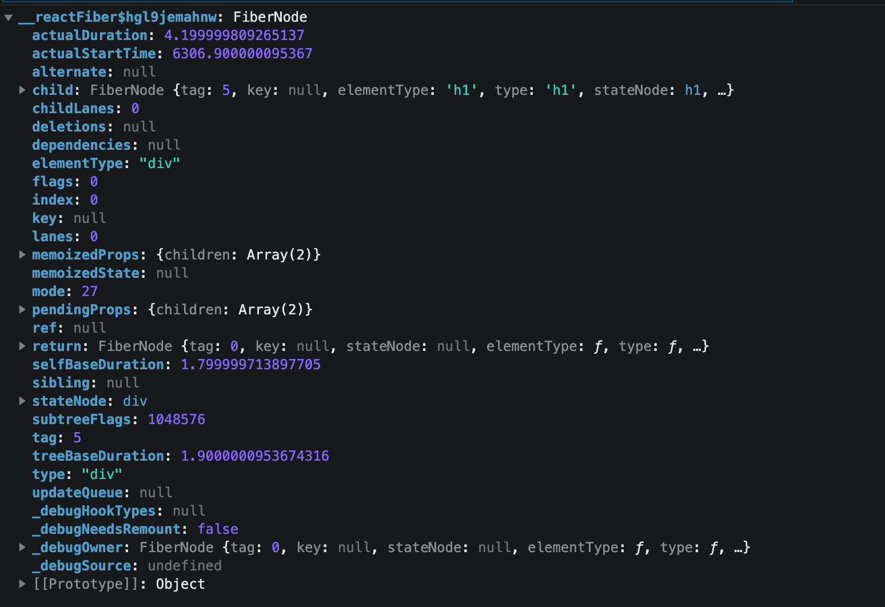
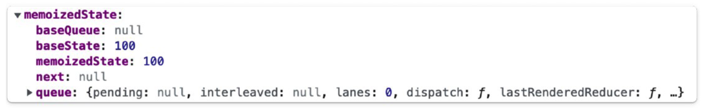
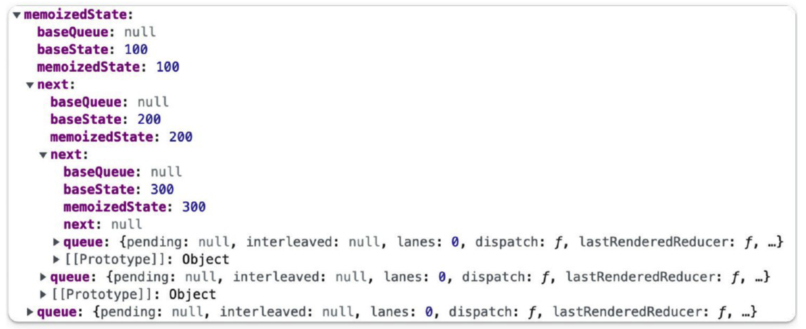
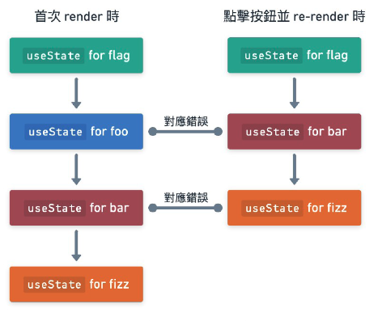
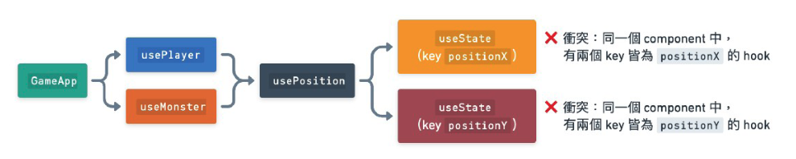
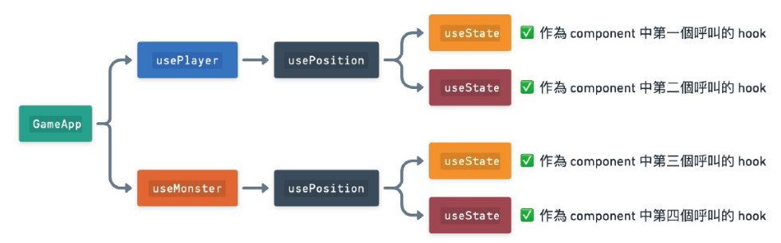

# React 思維進化

### :memo: note by Yo0

---

# About Me

<div class="columns">
<div>


</div>
<div>

## Frontend Developer

- Name：Yo0
- Guitartist, Songwriter
- Wehelp BootCamp, Full Stack
- React beginner

</div>
</div>

---

# 《React 思維進化》5-6

## useCallback 與 useMemo 的正確使用時機

---

## 觀念回顧與複習

- 函式在 function component 與 hooks 中是屬於資料流的一部分。

- 我們可以透過提供的 `useEffect` 的 `dependencies` 陣列參數來告訴 React，這個 effect 函式的同步化處理依賴於哪些資料。

- 如果陣列中記載的所有依賴資料都與上一次 render 時沒有差異，就代表沒有再次進行同步化的必要，因次 React 就可以安全的跳過本次 render 的副作用處理，來達到效能優化的目的。

---

# 5-6-1 useCallback 深入解析

1. hook 本身的效果並不是**效能優化**
2. 單一使用反而會使效能變得更慢。
3. **協助 React 中其他的效能優化手段保持正常運作**。

---

# `useCallback` 的呼叫方式

```javascript
const cachedFn = useCallback(fn, dependencies);
```

- 只能在 component function 內的頂層呼叫。
- 會接收兩個必填的參數
  1.  函式 : 傳遞一個依賴 component 內的資料(EX: props, state)
  2.  Dependencies (必填)

---

```jsx
import { useCallback } from "react";

export default function App() {
  const doSomething = useCallback(() => {
    console.log(props.foo);
  }, [props.foo]);
  // ...
}
```

1. 首次 render:
   `useCallback` 接受傳入的函式以及 `dependencies` 陣列，並記憶起來做為快取，將傳入的函式原封不動的回傳。
2. 後續 render 時，比較 `dependencies`:
   - 完全相同：忽略本次新傳入的函式，回傳前一次 render 所記憶的舊版函式。
   - 不同：以本次 render 新傳入的函式以及新的 `dependencies` 陣列記憶起來，覆蓋舊的版本，將新的函式原封不動的回傳。

---

Component function 在每次 render 的過程中都會先 inline 建立一個函式，然後才做為參數傳給 `useCallback` ，所以**我們並不會因為使用了 `useCallback` 而節省了「不必要的函式產生」**。

### 額外花費效能

- 每次 render 時重新生成函式。:dizzy:
- dependencies 的比較動作也是需要花費效能成本。

### 關注目的

- 對函式進行的快取行為。:star:
- 協助「**我們的函式能夠反應資料流的變化**」。

---

## 維持 hooks 依賴鏈的連動反應

---

```javascript
import { useState, useEffect } from "react";

export default function SearchResults() {
  const [query, setQuery] = useState("react");

  async function fetchData() {
    const result = await fetch(`https://foo.com/api/search?query=${query}`);
    // ...
  }
  useEffect(() => {
    fetchData();
  }, [fetchData]);
  // ...
}
```

<!-- ---

- `fetchData` 是在組件函數體內定義的。每次渲染，都會**創建一個新的函數實例**。
- `useEffect` 的依賴數組中包含了 `fetchData`，而 `fetchData` 在每次渲染時都是新的，這就導致了 effect 在每次渲染後都會執行，即使 `query` 沒有改變。
- `useEffect` 的 dependencies 效能優化永遠都會失敗。
- 因為需要比較依賴項目，所以比起沒有提供 `useEffect` 的 `dependencies` 的情況還要糟糕。 -->

---

#### :bookmark: Component 的資料流：資料 :arrow_right: 函式 :arrow_right: 副作用

問題：「函式」無法在節點上正確反應資料的更新與否

- 無論函式依賴的資料是否更新，每次 render 都會產生新的函式實例。
- 副作用依賴的函式實例更新，進而判斷需要更新。
- 無法安全跳過副作用的執行。

**效能優化失效 :arrow_right: 失去對資料變化的正確感知能力**

---

:point_down::point_down::point_down:

:stars:`useCallback` 讓資料流的變化連動反應到函式的變化

```javascript
import { useState, useEffect, useCallback } from " react";

export default function SearchResults() {
  const [query, useQuery] = useState("react");

  const fetchData = useCallback(async () => {
    const result = await fetch(`https://foo.com/api/search?query=${query}`);
    //...
  }, [query]);

  useEffect(() => {
    fetchData();
  }, [fetchData]);

  //...
}
```

<!-- ---

- `fetchData` 依賴 `query` 資料，將`query` 填寫到 `useCallback` 的 `dependencies` 陣列當中。
- `query`：
  - 相同：
    - `useCallback` 回傳前一次的 render 的 `fetchData` 函式。
    - 副作用不執行，優化效能。
  - 不同：
    - 回傳本次 render 所產生的 `fetchData` 函式。
    - 副作用再次執行。 -->

---

:dizzy::dizzy::dizzy:

- 透過 `useEffect` 輔助下，正確填寫`dependencies` 來維護依賴鏈中每一個環節的連動。
- 使函式完全可以參與到資料流之中，並且連帶使得`useEffect` 中的`dependencies` 的感知資料流的機制能夠運作正常。

---

## 配合 `memo` :

### 快取 component render 的畫面結果並重用以節省效能成本

---

> React 內建的 `memo` 有著相似 `useEffect` 的效能優化手段，當依賴的資料沒有更新時則跳過處理。
> `memo` 主要用於優化函數組件的渲染效能。

```javascript
import { memo } 'react';

function Child(props) {
    return (
        <>
            <div>Hello, {props.name}</div>
            <button onClick={props.showAlert}>
                alert
            </button>
        </>
    );
}
// 以 memo 方法來包裝 Child 這個 component 進行包裝加工
// 產生 MemorizedChild 這個加工過的新 component

const MemorizedChild = memo(Child);
```

---

## `memo` 方法

- React 內建提供的 Higher Order Component。
- 當 component 在 re-render 時，如果 props 相同，會跳過本次 render 流程。
- 直接回傳已經快取過的前一次 render 結果已達到效能優化的效果。
- 這也是一種資料流的變動感知，透過 props 資料檢查，來幫助 component 判斷是否跳過畫面 render 的處理。

---

:notebook: **Higher Order Component (HOC)**

- 在 React 中，一種經過特殊設計的函式。
- 以 component 做為參數，回傳一個加工過全新 component 。
- 輸出一個更強大，有額外功能或是資料的 component ，利於擴充與重用。

趨勢：

- HOC 的應用會趨向結合第三方套件。
  - react-redux `connect`, react-router `withRouter`, Material-UI `withStyles`
- 隨著 React Hooks 的引入，許多開發者開始轉向使用 Custom Hooks 來代替 HOCs。

---

### `memo` 遇到和 `useCallback` 一樣的問題。

`memo` 加工過的 component 在每次 render 時，如果 props 中包含的函式屬性都不同的話，其效能優化的效果永遠不會成功發揮。

---

```javascript
import { memo } 'react';

function Child(props) {
    return (
        <>
            <div>Hello, {props.name}</div>
            <button onClick={props.showAlert}>
                alert
            </button>
        </>
    );
}

const MemorizedChild = memo(Child);

function Parent() {
    const showAlert = () => alert('hi');

    return (
        <MemorizedChild
            name="zet"
            showAlert="{showAlert}"
        />
    );
}
```

<!-- ---

- 由於 Parent component 裡的 `showAlert` 是一個在每次 render 都會產生的函式實例，因此每次 render 都會不同。
- `showAlert` 函式會作為 prop 傳給子元件 `MemorizedChild`，導致每當 re-render 的過程中， `MemorizedChild` 的 memo 機制進行 props 比較時，都必定判定 `showAlert` prop 與前一次 render 時的值不同。
- 無法使用快取透過畫面的 render，`MemorizedChild` component 的 memo 優化永遠失效。 -->

---

利用 useCallback 來解決問題：

```jsx
import { memo } 'react';

function Child(props) {
    return (
        <>
            <div>Hello, {props.name}</div>
            <button onClick={props.showAlert}>
                alert
            </button>
        </>
    );
}

const MemorizedChild = memo(Child);

function Parent() {
    const showAlert = useCallback(
        () => alert('hi'),
        []);

    return (
        <MemorizedChild
            name="zet"
            showAlert="{showAlert}"
        />
    );
}
```

---

:rocket: 將 `showAlert` 函式透過 `useCallback` 包起來，加上誠實 dependencies，函式也能參與到資料流的變化感知當中，**協助 memo 機制也能正確的感知到資料流的變動**。
<br>
:stars: 當一個 component 裡面的函式有被 effect 函式所呼叫，或是會透過 prop 來傳給 memo 過的子元件時，會建議將這個函式以 `useCallback` 給包起來。

---

# 5-6-2 useMemo 深入解析

> 用途和使用情境跟 `useCallback` 是差不多了。
> 快取陣列或物件類型的資料
> 本身**真正用於節省計算的效能成本**。

---

## 維持 hooks 依賴鏈的連動反應

和 `useCallback` 相同的是，`useMemo` 一樣可以幫助我們在 hooks 依賴鏈 以及 `memo` 等情境的資料感知。

---

```javascript
import { memo, useEffect } feom 'react';

function Child(props){
    return(
        <div>Hello, {props.name}</div>
        {props.numbers.map(num=>(
            <p>{num}</p>
        ))}
    );
}

const MemorizedChild = memo(Child);

function Parent() {
    const numbers = [1, 2, 3];

    useEffect(
        () => console.log(numbers),
        [numbers]
    );

    return (
        <MemorizedChild
            name="zet"
            numbers = {numbers}
        />
     );
}
```

---

numbers 陣列在每次 render 都是全新不同的陣列

- 副作用`dependencies` 誠實，但效能優化失敗。
- `MemorizedChild` 的 render 效能優化失敗。

---

使用 `useMemo` 來處理：

```javascript
import { memo, useEffect, useMemo } feom 'react';

function Child(props){
    return(
        <div>Hello, {props.name}</div>
        {props.numbers.map(num=>(
            <p>{num}</p>
        ))}
    );
}

const MemorizedChild = memo(Child);

function Parent() {
    const numbers = useMemo(
            () => [1, 2, 3],
            []
        );

    useEffect(
        () => console.log(numbers),
        [numbers]
    );

    return (
        <MemorizedChild
            name="zet"
            numbers = {numbers}
        />
    );
}
```

---

## 節省計算複雜資料的效能

`useMemo` 本身也可以用於節省計算複雜資料的效能成本

```javascript
const memorizedValue = useMemo(() => computExpensiveValue(a, b), [a, b]);
```

- 當一個 component render 時才會產生的陣列或物件，有被 effect 函式有所依賴，或是會透過 prop 來傳給 memo 過的 子元件時，建議這個資料的產生以 `useMemo` 處理。
- 當資料計算耗時或是效能成本較高時，也可以用`useMemo` 的快取的行為來幫助你跳過不必要的重複計算。
- 一律對 dependencies 誠實，才能保證資料流動效果的可靠性。

---

## 章節重點觀念整理 1

1. Component 首次 render 時，`useCallback`會將傳入的函數以及依賴項目進行快取。
2. 後續 Re-render 時： - 這些依賴項目沒有更新，`useCallback` 會回傳先前快取的函式。 - 依賴項目有更新，`useCallback` 會更新快取，並回傳新的函式。
   <br>
   **:star2:確保函式在依賴項目沒有更新的情況下，維持不變**

---

## 章節重點觀念整理 2

- 在 `useCallback` 的輔助下，正確填寫依賴，讓函式可以完全參與到資料流之中，以協助其他需要判斷資料流變化的機制也能夠正確的連續運作。
  - EX : `useEffect` 的效能優化、`memo` 的畫面渲然優化。
- `useMemo` 和 `useCallback` 相似，只是通常用於**依賴項目是陣列或是物件**：
  - `usememo` 也能夠幫助我們在 hooks 依賴鏈以及 `memo` 等情境的資料流感知， 配合達到效能優化。
  - `usememo` 本身也可以用於節省計算複雜資料的效能成本。

---

## 章節重要觀念自我檢測

- `useCallback` 正確的用途以及適當的使用時機是什麼？
- `useMemo` 正確的用途以及適當的使用時機是什麼？

---

# 《React 思維進化》5-7

## Hooks 的運作原理和設計思維

---

## 觀念回顧與複習

- Component function 本身是描述特徵和行為的藍圖，而根據這個藍圖產生的實際個體，被成為實例。每個實例都有其獨立的狀態，並不會受到相同藍圖的其他實例的影響。
- Hooks 僅可以在 Component function 內的頂層作用預備被呼叫。

---

# 5-7-1 Hooks 的資料本體到底存放在何處

---

```jsx
import { useState } from "react";

export default function Counter() {
  const [count, setCount] = useState(0);

  return (
    <div>
      <h1>{count}</h1>
      <button onClick={() => setCount(count + 1)}>+1</button>
    </div>
  );
}

function App() {
  return (
    <>
      <Counter />
      <Counter />
      // 這兩個 React element 在 React 內部機制中 // 分別對應到不同的
      component實例 // 他們的 count state 是獨立、不互相影響的。
    </>
  );
}
```

<!-- ---

- `Counter` Component 中定義了一個 count state。
- 當我們每次去呼叫 `setCount` 來更新 state 並進行 re-render時，就可以從 `useState` 取得更新後的新 state 值。
- 從 `useState` 取出來的值專屬於該次 render 的快照值。 -->

---

# Fiber node 畫面



---

### React 設計的管理畫面機制：

1. React element : 描述「歷史時刻的畫面結構」。
2. Fiber Node : 儲存「最新狀態資料的畫面節點」資料。

<br>

### Fiber Node 和 React element 之間的關係與區別：

- Fiber node 的工作是負責保存並維護目前 React 應用程式的最新狀態資料，整個應用程式之中只會存在一份。以不斷被更新修改，表達「最新狀態」。
- React element 則是 render 流程的產物，用於描述某個歷史時刻的畫面結構，會隨著 re-render 而不斷重新產生好幾份。表達特定的歷史時刻。

---

### React 啟動 reconciliation 時

- Reconciler 會負責調度 component 的 render 並將資料的改動更新到 fiber node 裡。
- 將該次 render 出來的 React element 與前一次 render 的 React elment 進行比較。
- 移交給 renderer 處理實際 DOM 的操作更新。

---

### Fiber node 其實才是 React 應用程式的心臟

作為核心的最新應用程式狀態與畫面結構的本體；
React element 只是每次 render 時用來描述某個歷史時刻畫面結構的一種可拋棄式產物。

---

:star2: 論以 class component 宣告 state 或是以 function component 配合 useState 宣告 state，其實一樣會存放在 fiber node 中。
連續呼叫 setState 方法時的待執行計算佇列，也會被暫存在這裡。
<br>
:star2: 當我們在畫面結構中某處首次 render 出一個 component 類型的 React element 時，React 就會在整個應用程式的 fiber node 樹中的對應位置建立一個新的 component 實例，並在裡面存放 component 各種 hooks 的相關最新資料。

### 一個 component 實例就是指一個 fiber node。

---

當我們在呼叫 `useState` 時，就可以在 fiber node 的內容裡看到 state 資料被存放在其中：

```javascript
import { useState } from "react";

export default function APP() {
  const [count, setCount] = useState(100);

  // ...
}
```



---

當我們呼叫 `setCount` 方法並觸發 re-render 後，這個 fiber node 中的資料本體就真的會被覆蓋更新。因此每當我們的 component 再次 rerender 並經過 `setState` 時，其實是嘗試將那瞬間的 state 值「捕捉」起來並作為快照，以保證 function component 在每次 rerender 中取出的 state 值都是永遠不變的。

---

### 當我們在 component 中呼叫多個 `useState` 的情況？

```javascript
import { useState } from "react";

export default function APP() {
  const [count, setCount] = useState(100);
  const [count2, setCount2] = useState(200);
  const [count3, setCount3] = useState(300);

  // ...
}
```


<br>

---

# 5-7-2 為什麼 hooks 的運作是依賴於固定的呼叫順序

---

> 只能在 component function 內的頂層作用域呼叫 hooks。
> 而不能在條件式或是迴圈裡等地方呼叫。

<br>

```javascript
import { useState } from "react";

export default function APP() {
  const [count, setCount] = useState(100);
  const [name, setName] = useState("default name");
  const [flag, setFlag] = useState(false);

  // ...
}
```

---

等同於：

```javascript
import { useState } from "react";

export default function APP() {
  const state1Returns = useState(0);
  const count = state1Returns[0];
  const setCount = state1Returns[1];

  const state2Returns = useState(0);
  const name = state2Returns[0];
  const setName = state2Returns[1];

  const state3Returns = useState(0);
  const flag = state3Returns[0];
  const setFlag = state3Returns[1];
}
```

---

# Fiber node 畫面


<br>

---

Fiber node 內部是以「一個 state 連著下一個 state 」這中 linked list 的方式存放這些狀態在資料的。

Hooks 其實是以**呼叫順序**作為區分並依據這樣的順序存放資料。因此在 component 中呼叫的多個 hooks 時，他們會依照你呼叫的順序依序關聯存放。

```javascript
import { useState } from "react";

export default function APP() {
  const [count, setCount] = useState(100);
  // Component 裡第一個 hook
  const [name, setName] = useState("default name");
  // Component 裡第二個 hook，與第一個 state hook 的資料節點相連
  const [flag, setFlag] = useState(false);
  // Component 裡第三個 hook，與第二個 state hook 的資料節點相連

  // ...
}
```
---

以 linked list 這種資料結構設計下，如果某次 render 中跳過了其中一個 hook 的呼叫，有可能會導致在其後面呼叫的所有 hook 無法與前一次 render 時的 hook 做正確的對應。

```javascript
import { useState } from "react";

export default function App() {
  const [flag, setFlag] = useState(false);

  if (!flag) {
    const [foo, setFoo] = useState("foo");
  }

  const [bar, setBar] = useState("bar");
  const [fizz, setFizz] = useState("fizz");

  const handleClick = () => {
    setFlag(true);
  };

  return <button onClick={handleClick}>click me</button>;
}
```

<br>

---

上述範例中，點擊按鈕，並出發 re-render 時，第七行的`const [foo, setFoo] = useState('foo')` hook 呼叫會因為 `flag` 是 `true` 而被跳過。
此時會發生後面的 bar state 和 fizz state 的 hook，錯誤的與前一次 render 中的其他 hook 對應，導致兩次的 render 之間 hooks 呼叫順序無法對應的問題：



React 會因為此次會叫的到 hook 總數和前一次不同，而檢查到這個問題並報錯。
<br>

---

### React 之所以制定了 hooks 的呼叫規律

為了讓 component 中的 hook 被呼叫的順序在每次 render 之間都是維持固定不變的，以保證內部資料存取機制正確運作。

---

### **Linked List(鏈結串列)**

- 一種程式設計中的資料結構，由一連串「節點」組成。
- 每個節點包含 **資料** 和 **指向下一個節點的「指標」**

- 和 **Array 陣列** 不同之處：
  - 陣列是連續的資料塊
  - 鍊結串列不需要連續的記憶體空間，更適用於記憶體有限的狀況。

---

## 那我該怎麼安全的讓 hooks 不再被執行到

---

唯一合法的讓 hooks 不再運作的方法，其實就是去 unmount 包含了 這些 hooks 的 component。

```javascript
function Foo() {
    useEffect(() => { //... });
}

function App() {
    const [isFoo, setIsFoo] = useState(true);

    return isFoo ? <Foo /> : <Bar />;
}
```

當 `isFoo` 從 `true` 更新為 `false` 時，`<Foo />` 所對應的 component 實例就會被 unmout，如此一來 `Foo` component 內的副作用也就不會隨著 `App` component 的 re-render 而被執行到。

---

# :question:React 為什麼要將 hooks 依照順序性呼叫 hook:question:

# :question:而不是設計成自定義 key 之類的方式:question:

---

# 5-7-3 Hooks 的 誕生是為了解決什麼問題

---

### React 打從一開始的目標：

:arrow_right:就是要將 hooks 設計成綁定配合 function component 使用。
<br>
原本 class Component 這種偏向物件導向的設計會造成很多概念上的衝突：

- class component 的成員方法無法參與資料流的變化
- `this.props`、`this.state` 在非同步的事件中可能錯誤的拿到最新資料。

---

### 1. 為了貼近**一律重繪、immutable**等核心概念

React 決定往更加靠攏函數式程式設計的方向時發展。
除了 function component 之外，React 必須設計一套全新的機制與 API 來解決幾個重要的問題。

---

## 2. 讓 function component 擁有狀態

1. function component 能夠讓 React 的每次 render 獨立不互相干擾，解決非同步事件從 `this.props` 讀取資料導致的問題。
2. 畫面管理在本質上是難以避免有「狀態資料」，且 component 中還可能同時有多種狀態資料。
3. 支援多種狀態相互引用傳值的需求，且又要避免命名衝突等問題。

##### **需要一個有足夠彈性與開發者互動，又能滿足在 React 內部維護的 fiber node 的 API 設計**

---

## 3. Component 之間的邏輯重用

1. 過去 class component 時代，React 從未推官方的 component 邏輯重用 API。
2. class component 寫法中，state 與 生命週期 API 都必須在 component 中才能定義，而無法獨立於 component 之外去定義。
3. 同一功能可能需要在許多生命周期 API 都放入邏輯，難以抽出來在多個 component 之間共用。
   <br>
   在 class component 時代中，有許多社群提出的設計模式來繞圈解決邏輯重用的問題，主流像是 high order component 以及 render prop，不過它們**都無法完美解決所有問題**，仍然有命名衝突、依賴不透明...等缺陷。

---

# 5-7-4 Hooks API 的設計思維與脈絡

---

### Hooks 的目標

是想要配合 function component 設計一套夠定義，管理並且方便功用邏輯的 API，同時解決幾個過去的方案會遇到的問題：

- 避免衝突命名。
- 依賴透明，被重用的不同邏輯可以自由拆分、組合與呼叫。
- 避免污染 render 出的 react element 結構會包含一些與實際畫面無關的東西。

---

### 以函式作為載體

- 有時想重用一個功能的邏輯或流程，以 component 作為定義載體的方式可能會遇到一些問題：
  - EX : `high order component`：
    - 兩段為了重用邏輯寫的 component 裡面都有 `name` 的 prop，此時如果同時套用到同一個 component 身上，就會發生命名衝突。
    - 兩段邏輯之間無法彈性互動，只能 A 覆蓋 B or B 覆蓋 A，兩者擇一。

---

```jsx
const UserProfile = ({ name, email, location }) => (
  <div>
    <h2>{name}</h2>
    <p>Email: {email}</p>
    <p>Location: {location}</p>
  </div>
);

const withUserLocation = (WrappedComponent) => {
  return (props) => {
    const location = "New York"; // 假設這是從某個 API 獲取的
    return <WrappedComponent {...props} location={location} />;
  };
};

const withUserPreferences = (WrappedComponent) => {
  return (props) => {
    const preferences = {
      theme: "dark",
      language: "en",
      location: "London", // 注意這裡也有一個 location 屬性
    };
    return <WrappedComponent {...props} {...preferences} />;
  };
};

const EnhancedUserProfile = withUserPreferences(withUserLocation(UserProfile));

const App = () => {
  return <EnhancedUserProfile name="John Doe" email="john@example.com" />;
};
```

---

### 以函式作為載體

- Hooks API 被設計成函式的主要原因是利用**函式特性**：

  - 能讓邏輯和流程能夠以最大彈性被拆分與呼叫的形式。
  - 函式可以自由的設計參數與回傳值，很好的自由拆分與組合。

- Hooks 的呼叫是在 component function render 過程中發生的，也就是函式的執行過程，所以這些狀態與邏輯的定義不一定要是 component，而**可以是獨立的自定義 Hook 函式**。
- 無論在一個 component 中呼叫了多少的 hooks，都不會污染到 render 出來的 React element 結構，**讓與畫面渲染無關的邏輯與畫面本身分離**，提升 component 程式碼可讀性。

---

### 依賴於固定的呼叫順序

- 以函式的形式定義流程和邏輯雖然很直覺方便，但定義狀態狀態資料是相當不直覺的且很容易讓人誤解其行為。
- 因此 React 要求 component 裡 所有 hooks 在每一次 render 時 都會以固定的順序被呼叫到，以保證內部的資料狀態存取機制正常運作。

---

### 命名衝突問題

React 將 hooks 設計成以順序性方式來儲存並區別資料，大多數人第一知覺應該會是想要以一個唯一的 key 來定義並區別不同的資料：

```javascript
const [name, setName] = useState("name", "");
const [surname, setSurname] = useState("surname", "");
const [width, setWidth] = useState("width", 0);

// 這不時真實的 Hooks API 只是假想的 API 設計： useState(key, initialState)
```

##### 自定義 key 的設計會有難以避免的問題：**命名衝突**

---

- 事實上，我們無法在同一個 component 裡呼叫兩次 key 皆為 `name` 的 `useState`。
- 如果這些狀態僅定義在一個 component 裡的話，這種情況還在可以控制的範圍內，畢竟開發者可以在自己的 component 中避免重名。
- 如果考慮到重用問題的話，每當開發者在自訂義 hook 內定義 state，就可能導致重用了這個自定義的 hook 的 component 壞掉 :arrow_right: 因為在 component 內可能也定義了相同 key 的 state。

---

React **選擇依賴順序呼叫 hooks**，讓 hooks 的 key 都是一種順序性的 Index，而不是基於開發者自定義的 key 來實現呼叫 hooks。
這種設計巧妙地解決了潛在的命名衝突和重用問題，同時也簡化了 API 的使用。

---

## 鑽石問題

基於 key 命名的 hooks 設計也會導致一個程式設計領域中惡名昭彰的問題
又稱為**多重繼承問題**或**菱形繼承問題**。

---

```javascript
//hooks.js
function usePosition() {
    const [x,setX] = setState('positionX',0);
    const [y,setY] = setState('positionY',0);
    // 假想的 hooks API
    // 指定至些 hooks 的 key 為 positionX 和 positionY
    return {x, setX, y, setY};
}

export function usePlayer() {
    const position = usePosition();

    // ... 其他 player 才會有的資料或方法

    return {.....,position};
}

export function useMonster() {
    const position = usePostition();

    /// ... 其他 monstor 才會有的資料或方法

    return {.....,position};
}

//usePlyer 和 useMonster 都各自呼叫了 usePosition
```

---

在 `GameApp` component 中同時呼叫了`usePayer`，`useMonster`這兩種 hook 時，鑽石問題產生了：

```javascript
//GameApp.js

import { usePlayer, useMonster } from "./hooks";

export default function GameApp() {
  const player = usePlayer();
  const monster = useMonster();

  // ...
}
```

---

當在同一個 component 中去呼叫 `usePosition` 兩次，他們會分別在 component 裡面嘗試註冊名為`pdsitionX`與`positionY`的 hook，這會導致命名衝突問題。

<br>



---

如果是基於 hooks 在 compnent 裡的固定呼叫順序，則可以自然的解決了這個問題。
<br>


---

**純粹的函式呼叫並不會產生鑽石問題，他們會自然的形成樹狀結構。**
Component 只需要以些自定義 hook 在層層呼叫所展開後的整體呼叫順序，來區分並追縱 hooks 的狀態資料即可，這樣的設計能讓我們可以向命名衝突的噩夢說再見。

---

# 章節重點觀念整理

### Fiber node：

- Fiber node 的工作是**負責保存並維護目前 React 應用程式的最新狀態資料，整個應用程式之中只會存在一份**；而 React element 則是 render 流程的產物，用於**描述某個歷史時刻的畫面結構**，會隨著不斷 re-render 而不斷重新產生好幾份。
- 與 React element 「一經建立就不會再被修改，是在表達特定歷史時刻」不同的是，fiber node 是在保存「最新的狀態」，因此會不斷的被更新修改以維護最新的狀態資料。
- Fiber node 是保存並維護 hooks 資料的實際載體。

---

# 章節重點觀念整理

### 為什麼 hooks 的運作是依賴於固定的呼叫順序：

- 因為一旦有某個 hook 的呼叫在某次 render 被跳過，後續所有 hook 的順序都會跟著跳號，導致 React 內部在存取狀態資料時會有錯置的問題。

### Hooks API 的設計思維與脈絡：

- 以函式作為載體，能讓邏輯與流程以最大的彈性被拆分與呼叫。函式可以自由的設計參數與回傳值，也能很好的自由拆分與組合。
- 依賴於固定的呼叫順序，來避免巢狀呼叫時的鑽石問題。純粹的函式呼叫並不會有鑽石問題，它們會自然的形成樹狀結構。而 component 只需要以這些自定義 hook 在層層呼叫所展開後的**整體呼叫順序**，來區分並追蹤 hooks 的狀態資料即可。

---

## 章節重要觀念自我檢測

- Hooks 的資料本體到底存放在何處？
- 為什麼 hooks 的運作是依賴於固定的呼叫順序？
- Hooks 如何透過順序式的資料結構設計來避免巢狀呼叫時的鑽石問題？

---


## Thank You For Your Listening :rocket:
